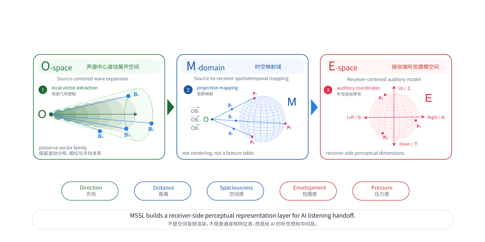
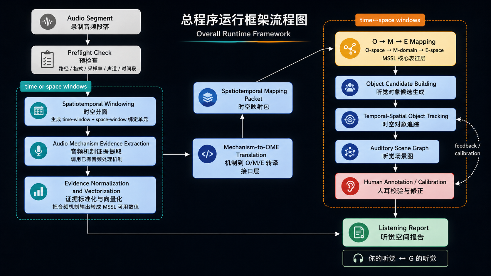
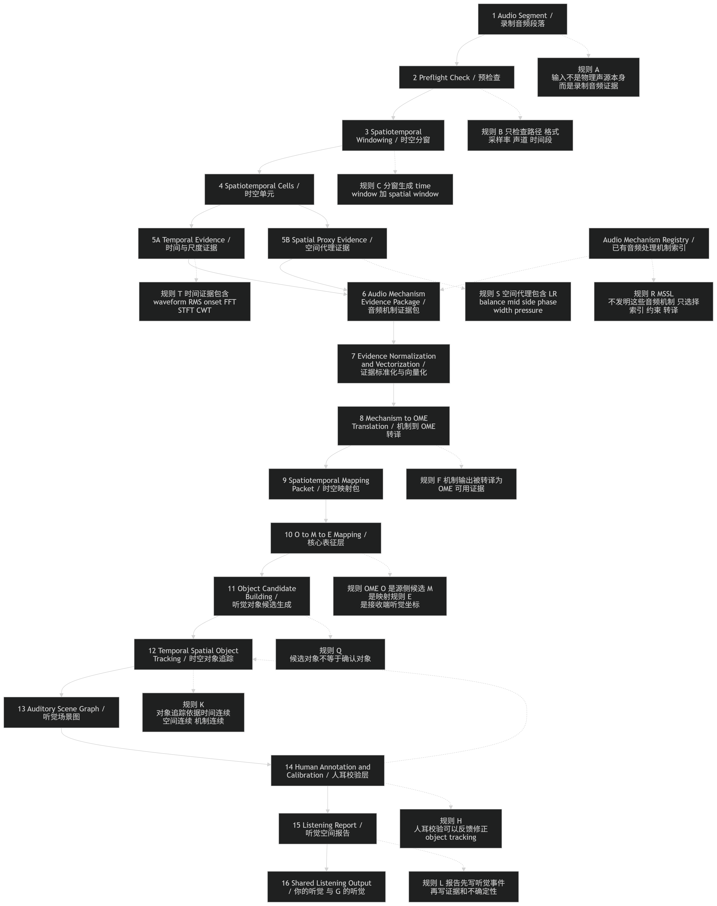

# Minimal Space for Simulated Listening

Project codename: **Groove Ear / 给 AI 耳朵**

> We do not train taste.
> We build a minimal spatiotemporal domain for simulated listening.
>
> 我们不训练品味。
> 我们建立一个用于模拟听觉的最小时空域。

---

# Visual Overview / 可视化总览

These diagrams summarize the current MSSL modeling and runtime structure.
They are presentation diagrams for the README page, not separate execution outputs.

这些图用于展示当前 MSSL 的建模框架与运行结构。
它们是 README 展示图，不是单独的程序输出文件。

## Sound Modeling Framework / 声的建模框架

This diagram explains the core O → M(A/B) → E modeling logic:
source-centered wave-expansion space, source-to-receiver mapping domain, and receiver-centered auditory modeling space.

这张图说明核心的 O → M(A/B) → E 建模逻辑：
声源中心的波动展开空间、声源到接收端的时空映射域，以及接收端听觉建模空间。



## Overall Runtime Framework / 总程序运行框架

This diagram shows the high-level runtime structure:
audio segment → evidence extraction → mechanism-to-OME translation → mapping packet → O/M/E representation → object tracking → human calibration → listening report.

这张图展示总运行结构：
音频段落 → 证据提取 → 机制到 O/M/E 转译 → 时空映射包 → O/M/E 表征 → 对象追踪 → 人耳校验 → 听觉报告。



## Detailed Runtime Flow / 细分运行流程

This diagram keeps execution steps and rule notes separated.
Solid arrows describe runtime execution; dotted arrows describe constraints or calibration feedback.

这张图把执行步骤和规则说明分开：
实线表示程序运行路径，虚线表示规则说明或校验反馈。



## 0. Name

**Minimal Space for Simulated Listening** is the formal project name.

**Groove Ear** is the project codename, repository name, and working identity.

Here, **space** does not mean pure geometric space.
It means a **spatiotemporal mapping domain**: the minimal domain in which sound can be emitted, propagated, received, represented, predicted, and reconstructed as listening.

```text
O = source origin
M = source-to-receiver mapping domain
E = ear / listening receiver
```

Sound is modeled as a propagation relation from **O** to **E**, through **M**, unfolding through both space and time.

---

## 0. 名称

**Minimal Space for Simulated Listening** 是项目正式名称。

**Groove Ear** 是项目代号、仓库名和工作名。

这里的 **space** 不是单纯的几何空间。
它指的是一个 **时空映射域**：声音能够被发出、传播、接收、表征、预测，并被重建为听觉经验的最小域。

```text
O = 声源初始点
M = 声源到接收端的映射域
E = 耳朵 / 接收感知端
```

声音被建模为一个从 **O** 出发，经由 **M**，抵达 **E** 的传播关系，并且同时在空间和时间中展开。

---

# 1. What This Project Is

**Minimal Space for Simulated Listening** is an experimental project for defining the minimal spatiotemporal conditions under which simulated listening can happen.

It does not begin by treating audio as:

```text
a flat waveform
a database object
a list of extracted features
a music label
a taste object
```

It begins by asking:

```text
What is sound?
How does sound travel from a source to an ear?
What minimal mapping domain is required for listening to be simulated?
```

The project’s first model is not an audio-feature model.

It is a **source-to-receiver mapping model**.

```text
source-centered sound space
→ source-to-receiver mapping domain
→ receiver-centered auditory space
```

Audio features are still important, but they are not the foundation.
They are evidence used later to support the mapping.

---

## 1. 这个项目是什么

**Minimal Space for Simulated Listening** 是一个实验性项目，用来定义“模拟听觉”发生所需的最小时空条件。

它的第一步不是把音频看成：

```text
一条平面波形
一个数据库对象
一组待提取特征
一个音乐标签
一个品味对象
```

它首先问的是：

```text
声音是什么？
声音如何从声源抵达耳朵？
模拟听觉需要怎样的最小映射域？
```

项目的第一模型不是音频特征模型。

它是一个 **声源到接收端的映射模型**。

```text
声源中心空间
→ 声源到接收端的映射域
→ 接收端听觉空间
```

音频特征仍然重要，但它们不是地基。
它们是后续用来支持映射判断的证据。

---

# 2. What This Project Is Not

This project is not:

```text
a Shazam-like recognition engine
a music recommendation system
a music generation backend
a lyric search wrapper
a database matcher
a normal K-song scoring system
a conventional MIR feature table
an automatic music-review generator
a tool for training AI taste
```

It does not attempt to decide whether a song is good.

It attempts to define the conditions under which a machine can simulate listening.

The small application entry point is **singing feedback**.

The larger goal is a **D→A listening translation protocol**: from digital evidence back toward reconstructable auditory experience.

Here:

```text
D = digital signal, computable evidence, encoded trace
A = reconstructable auditory field / listening experience
```

**A** does not merely mean analog sound quality.
It means a body-like, spatial, temporal, and perceptual listening world that can be reconstructed from evidence.

---

## 2. 这个项目不是什么

这个项目不是：

```text
类似 Shazam 的识曲引擎
音乐推荐系统
音乐生成后端
歌词搜索包装器
数据库匹配器
普通 K 歌评分系统
传统 MIR 特征表
自动乐评生成器
训练 AI 品味的工具
```

它不试图判断一首歌好不好。

它试图定义：机器在什么条件下可以模拟“听见”。

项目的小应用入口是 **演唱反馈**。

更大的目标是一个 **D→A 听觉转译协议**：从数字证据回到可重建的听觉经验。

这里：

```text
D = 数字信号、可计算证据、编码痕迹
A = 可重建的听觉场 / 听觉经验
```

**A** 不只是 analog sound quality 或模拟音质。
它指的是一种可以从证据中重建出来的、带有身体感、空间性、时间性和感知结构的听觉世界。

---

# 3. Core Premise

Conventional audio analysis often begins with a signal:

```text
x(t)
```

or digital samples:

```text
x[n]
```

This is useful for signal processing, but it is not enough for simulated listening.

A waveform can describe pressure variation over time at a capture point or channel.
But listening does not experience sound as a one-dimensional curve.

Listening involves:

```text
source
receiver
space
time
distance
direction
pressure
size
spread
motion
memory
projection
reception
```

Therefore, this project does not first ask:

```text
What features does this audio signal contain?
```

It first asks:

```text
How can sound, as a propagation relation from source to ear,
be represented as a minimal mapping between two coordinate systems?
```

The foundation is:

```text
O-space → M-domain → E-space
```

Where:

```text
O-space = source-centered coordinate system
M-domain = source-to-receiver spatiotemporal mapping domain
E-space = receiver-centered auditory coordinate system
```

---

## 3. 核心前提

传统音频分析通常从信号开始：

```text
x(t)
```

或者从数字采样开始：

```text
x[n]
```

这对于信号处理当然有用，但它不足以支撑“模拟听觉”。

波形可以描述某个采样点或某个声道上的压力随时间变化。
但听觉并不是把声音经验为一条一维曲线。

听觉涉及：

```text
声源
接收端
空间
时间
距离
方向
压力
大小
扩散
运动
记忆
投影
接收
```

因此，这个项目的第一问题不是：

```text
这段音频包含哪些特征？
```

而是：

```text
声音作为一个从声源到耳朵的传播关系，
如何被表示成两个坐标系之间的最小映射？
```

项目地基是：

```text
O-space → M-domain → E-space
```

其中：

```text
O-space = 声源中心坐标系
M-domain = 声源到接收端的时空映射域
E-space = 接收端听觉坐标系
```

---

# 4. Minimal Mapping Domain

The first version assumes an ideal playback environment.

It temporarily ignores:

```text
room reflections
wall absorption
environmental noise
device coloration
recording-space reverb
individual ear-shape difference
complex multi-source interference
```

This does not deny real-world complexity.
It postpones it.

The purpose is to define the minimal unit required for sound to travel from emission to reception.

A useful analogy is in-ear headphone listening:

```text
the external environment is simplified
the source-to-ear path is compressed
sound enters a receiver-centered perceptual space
```

This ideal model asks:

```text
What is the simplest spatiotemporal domain in which sound can be emitted, mapped, and heard?
```

---

## 4. 最小映射域

第一版先假设一个理想播放环境。

它暂时不考虑：

```text
房间反射
墙面吸收
环境噪声
设备染色
录音空间残响
个体耳形差异
复杂多声源干扰
```

这不是否认真实世界的复杂性。
而是先把复杂性后置。

目的是定义声音从发出到接收所需的最小单元。

一个接近的类比是入耳式耳机听感：

```text
外部环境被简化
声源到耳朵的路径被压缩
声音直接进入接收端感知空间
```

这个理想模型问的是：

```text
声音能够被发出、映射、听见，所需的最简单时空域是什么？
```

---

# 5. Minimal Mapping Packet

The minimal unit is not simply an audio window.

It is a **source-to-receiver mapping packet**.

For each time window, the project records:

```text
how the source emits
how the mapping domain transforms
how the receiver perceives
```

A minimal packet may look like:

```text
mapping_packet {
  time_window

  source_space {
    origin
    directionality_center
    emission_strength
    emission_shape
  }

  mapping_domain {
    source_to_receiver_relation
    distance_relation
    scale_transform
    pressure_transfer
    spread_transform
    temporal_continuity
  }

  receiver_space {
    left_right
    near_far
    high_low
    perceived_size
    perceived_pressure
    perceived_spread
    perceived_motion
  }
}
```

This packet is not a claim of perfect physical reconstruction.

It is a minimal intermediate representation for simulated listening.

---

## 5. 最小映射包

最小单元不是单纯的音频窗口。

它是一个 **声源到接收端的映射包**。

在每个时间窗口里，项目记录的是：

```text
声源端如何发出
映射域如何转换
接收端如何感知
```

一个最小映射包可以写成：

```text
mapping_packet {
  time_window

  source_space {
    origin
    directionality_center
    emission_strength
    emission_shape
  }

  mapping_domain {
    source_to_receiver_relation
    distance_relation
    scale_transform
    pressure_transfer
    spread_transform
    temporal_continuity
  }

  receiver_space {
    left_right
    near_far
    high_low
    perceived_size
    perceived_pressure
    perceived_spread
    perceived_motion
  }
}
```

这个映射包不是对真实物理声场的完美还原。

它是用于模拟听觉的最小中间表征。

---

# 6. Receiver-Side Auditory Space

The receiver-side coordinate system is based on auditory perspective.

Basic axes:

```text
left ↔ right
near ↔ far
high ↔ low
```

Here, “near” does not simply mean physical distance.

It means:

```text
closer to the listening center
or
closer to the center of the source’s directionality
```

The basic auditory perspective rule is:

```text
nearer = larger / stronger / clearer / more pressing
farther = smaller / weaker / softer / more diffused
```

This is similar to visual perspective, but it belongs to auditory space.

The receiver-side space describes how sound appears after it reaches the listening receiver:

```text
where it is
how close it is
how large it feels
how much pressure it carries
how it spreads
how it moves
how it remains in memory
```

---

## 6. 接收端听觉空间

接收端坐标系基于听觉透视。

基础坐标轴是：

```text
左 ↔ 右
近 ↔ 远
高 ↔ 低
```

这里的“近”不只是物理距离。

它指：

```text
更靠近听觉中心
或
更靠近声源指向性的中心
```

基础听觉透视规则是：

```text
越近 = 越大 / 越强 / 越清晰 / 越有压迫
越远 = 越小 / 越弱 / 越柔和 / 越扩散
```

这类似视觉中的透视，但它属于听觉空间。

接收端空间描述的是声音抵达接收感知端之后如何显现：

```text
它在哪里
它有多近
它听起来有多大
它携带多少压力
它如何扩散
它如何运动
它如何留在记忆中
```

---

# 7. Technical Evidence Comes Later

This project does not reject audio processing.

But technical features are deferred.

The project does not define itself first through:

```text
RMS
STFT
phase
mid/side
spectral centroid
HRTF
Ambisonics
source separation
frequency bins
```

These may become evidence tools.

But every technical feature must answer the mapping question:

```text
How does this measurement help explain the mapping between O-space and E-space?
```

Examples:

```text
RMS may support perceived_pressure
mid/side may support perceived_spread
phase relation may support left_right or depth proxy
spectral energy may support emission_shape
reverb tail may support near_far or distance proxy
```

Technical features are not the ontology of sound.

They are tools for estimating the mapping.

---

## 7. 技术证据后置

这个项目不排斥音频处理。

但技术特征必须后置。

项目不首先用这些术语定义自己：

```text
RMS
STFT
phase
mid/side
spectral centroid
HRTF
Ambisonics
source separation
frequency bins
```

这些以后都可以成为证据工具。

但每一个技术特征都必须回答这个映射问题：

```text
这个测量如何帮助解释 O-space 与 E-space 之间的映射？
```

例如：

```text
RMS 可以支持 perceived_pressure
mid/side 可以支持 perceived_spread
phase relation 可以支持 left_right 或 depth proxy
spectral energy 可以支持 emission_shape
reverb tail 可以支持 near_far 或 distance proxy
```

技术特征不是声音的本体。

它们是估计映射关系的工具。

---

# 8. Translation Rule

The project should not first say:

```text
RMS increased.
Side ratio increased.
Spectral centroid changed.
```

It should first say:

```text
The sound moved closer to the listening center.
The receiver-side sound became larger and more pressing.
The sound spread from a central point toward both sides.
The main body retreated, but spatial residue remained near the ears.
```

Technical evidence can come after:

```text
Evidence: energy increased, side ratio widened, reverb tail extended.
```

The first language of the project is auditory-spatial language.

---

## 8. 转译规则

项目不应该先说：

```text
RMS 上升。
Side ratio 上升。
Spectral centroid 改变。
```

它应该先说：

```text
声音更靠近听觉中心。
接收端感到声音变大、变有压力。
声音从中心点向两侧展开。
主体后退，但空间残留仍在耳边。
```

技术证据可以后置：

```text
证据：能量上升、side ratio 增大、残响尾部延长。
```

项目的第一语言是听觉空间语言。

---

# 9. Relation to JEPA and Auditory Representation Prediction

This project is not a claim that Groove Ear has already implemented JEPA.

It is also not a claim that the project is already a complete world model.

More precisely, **Minimal Space for Simulated Listening** borrows the logic of JEPA to perform a logical-space decomposition of listening in the physical world.

JEPA suggests an important shift:

```text
do not directly predict the surface output;
first define and predict an intermediate representation.
```

For this project, the target is not an image patch, a video frame, or a language token.

The target is an auditory representation:

```text
source origin O
→ spatiotemporal mapping domain M
→ receiver E
```

In this sense, the project is an early model attempt at **auditory representation prediction**.

It tries to define:

```text
what the minimal auditory representation is
how sound can be mapped from source to receiver
how this representation can remain anchored to evidence
how it may later support prediction, calibration, and reconstruction
```

The project’s first task is therefore not to generate listening descriptions directly.

It is to define the logical space in which listening can be represented before it is described.

Later, this space may support predictive modeling:

```text
current auditory representation
→ predicted next auditory representation
→ evidence-based correction
→ human-readable listening reconstruction
```

So the relation to JEPA should be understood as:

```text
JEPA = representation prediction as a modeling logic
Minimal Space for Simulated Listening = an auditory attempt to define such a representation space
```

The project does not claim to be a finished JEPA system.

It uses JEPA’s logic to ask:

```text
What is the minimal representation space in which physical listening can be simulated?
```

---

## 9. 与 JEPA 和听觉表征预测的关系

这个项目不是在声称 Groove Ear 已经实现了 JEPA。

它也不是在声称项目已经是一个完整的世界模型。

更准确地说，**Minimal Space for Simulated Listening** 是借鉴 JEPA 的思路，对物理世界中的听觉过程做一次逻辑空间的拆解。

JEPA 提供的关键转向是：

```text
不要直接预测表层输出；
先定义并预测一个中间表征。
```

对这个项目来说，目标不是图像 patch、视频帧，也不是语言 token。

目标是一个听觉表征：

```text
声源初始点 O
→ 时空映射域 M
→ 接收端 E
```

在这个意义上，这个项目是一次 **听觉表征预测** 的早期模型尝试。

它试图定义：

```text
最小听觉表征是什么
声音如何从声源端映射到接收端
这个表征如何持续锚定证据
它以后如何支持预测、校准和重建
```

因此，项目的第一任务不是直接生成听感描述。

而是先定义一个逻辑空间：听觉在被描述之前，如何被表征。

之后，这个空间可以支持预测建模：

```text
当前听觉表征
→ 下一时间窗口的听觉表征预测
→ 基于证据的校正
→ 人类可读的听感重建
```

所以，它和 JEPA 的关系应该理解为：

```text
JEPA = 以表征预测为核心的建模逻辑
Minimal Space for Simulated Listening = 在听觉领域定义这种表征空间的一次尝试
```

这个项目不声称自己已经是一个完成的 JEPA 系统。

它借用 JEPA 的逻辑来追问：

```text
物理世界中的听觉，要被模拟，需要怎样的最小表征空间？
```

---

# 10. Current Document Layers

This repository is a clean rebuild.

The current foundation is not the old `src/groove_ear/` package structure.
The active project layers are documented in this repository as minimal concept and validation documents.

Current foundation documents:

```text
docs/minimal_mapping_domain.md
docs/mapping_packet.md
docs/source_receiver_mapping.md
docs/representation_prediction.md
docs/first_validation_loop.md
docs/implementation_plan.md
```

Current V3 object-tracking documents:

```text
docs/temporal_spatial_object_tracking.md
docs/source_separation_as_object_evidence.md
docs/vocal_locking_as_object_evidence.md
```

These V3 documents define how object evidence, source-separation evidence, and vocal-locking evidence may support receiver-side temporal-spatial object tracking.

They do not implement:

```text
source separation
singer identification
voiceprint recognition
ASR
lyric recognition
karaoke scoring
true physical 3D localization
```

---

## 10. 当前文档层级

本仓库是 clean rebuild。

当前地基不是旧的 `src/groove_ear/` 包结构。
当前项目层级由本仓库中的最小概念文档和验证文档定义。

当前地基文档：

```text
docs/minimal_mapping_domain.md
docs/mapping_packet.md
docs/source_receiver_mapping.md
docs/representation_prediction.md
docs/first_validation_loop.md
docs/implementation_plan.md
```

当前 V3 对象追踪文档：

```text
docs/temporal_spatial_object_tracking.md
docs/source_separation_as_object_evidence.md
docs/vocal_locking_as_object_evidence.md
```

这些 V3 文档定义 object evidence、source-separation evidence、vocal-locking evidence 如何支持接收端时空对象追踪。

它们不实现：

```text
声源分离
歌手身份识别
声纹识别
ASR
歌词识别
K 歌评分
真实物理三维定位
```

---

# 11. Current Non-Goals

The project is not currently trying to solve:

```text
full room acoustics
speaker directivity
individual HRTF
complete biological voice production
full source separation
lyrics understanding
music recommendation
song identification
genre classification
MIR-style feature maximization
exact real-world 3D reconstruction
taste judgment
```

These may become optional evidence layers later.

They are not the foundation.

---

## 11. 当前非目标

项目当前不试图解决：

```text
完整房间声学
扬声器指向性
个体 HRTF
完整生物发声机制
完整声源分离
歌词理解
音乐推荐
识曲
风格分类
MIR 式特征最大化
真实世界三维声场精确还原
品味判断
```

这些以后可以成为可选证据层。

但它们不是地基。

---

# 12. Current Repository Structure

Current repository structure:

```text
AGENTS.md
README.md
references/
docs/
scripts/
outputs/  # generated outputs, local only, not project foundation
.venv/    # local environment, not committed
V3_AUDIO_OBJECT_RUNCHECK_UPDATE.md
V3_OBJECT_TRACKING_UPDATE.md
V4_1_FOUNDATION_ADAPTERS_UPDATE.md
V4_2_HUMAN_CALIBRATED_LISTENING_UPDATE.md
V4_FULL_SONG_ANALYSIS_UPDATE.md
声的建模框架图解.png
总体框架流程图.png
mermaid-diagram.png
```

Current scripts:

```text
scripts/run_first_validation.py
scripts/run_audio_object_runcheck.py
```

Generated outputs belong under `outputs/` and should not be treated as project foundation.

There is currently no active `src/` package and no committed `tests/` directory.

---

## 12. 当前仓库结构

当前仓库结构：

```text
AGENTS.md
README.md
references/
docs/
scripts/
outputs/  # generated outputs, local only, not project foundation
.venv/    # local environment, not committed
V3_AUDIO_OBJECT_RUNCHECK_UPDATE.md
V3_OBJECT_TRACKING_UPDATE.md
V4_1_FOUNDATION_ADAPTERS_UPDATE.md
V4_2_HUMAN_CALIBRATED_LISTENING_UPDATE.md
V4_FULL_SONG_ANALYSIS_UPDATE.md
声的建模框架图解.png
总体框架流程图.png
mermaid-diagram.png
```

当前脚本：

```text
scripts/run_first_validation.py
scripts/run_audio_object_runcheck.py
```

`outputs/` 下的文件是生成物，不是项目地基。

当前没有 active `src/` 包，也没有已提交的 `tests/` 目录。

---

# 13. Python Environment

This project should be runnable from any cloned project folder.

Create the virtual environment inside the project root:

```text
<project-root>/.venv
```

On Windows, use the project venv Python:

```powershell
.\.venv\Scripts\python.exe
```

On macOS / Linux, use:

```bash
./.venv/bin/python
```

Do not use:

```text
bundled Python
an unrelated global Python
global pip
```

---

## 13. Python 环境

本项目应当可以从任意 clone 下来的项目文件夹运行。

虚拟环境应创建在项目根目录内：

```text
<project-root>/.venv
```

Windows 使用项目 venv Python：

```powershell
.\.venv\Scripts\python.exe
```

macOS / Linux 使用：

```bash
./.venv/bin/python
```

不要使用：

```text
bundled Python
无关的全局 Python
全局 pip
```

---

# 14. Verification

Use the project venv Python.

Do not call `pytest` directly.
Do not assume `python` points to the project venv.
Do not assume `src/` or `tests/` exists.

Current environment checks:

```powershell
.\.venv\Scripts\python.exe --version
.\.venv\Scripts\python.exe -m pip --version
.\.venv\Scripts\python.exe -m pytest --version
```

Current script smoke checks:

```powershell
.\.venv\Scripts\python.exe .\scripts\run_first_validation.py --help
.\.venv\Scripts\python.exe .\scripts\run_audio_object_runcheck.py --help
```

Run tests only after a `tests/` directory exists:

```powershell
.\.venv\Scripts\python.exe -m pytest
```

Run compile checks only for paths that exist:

```powershell
.\.venv\Scripts\python.exe -m compileall scripts
```

If a future `src/` package is added, then compile it explicitly:

```powershell
.\.venv\Scripts\python.exe -m compileall src
```

---

## 14. 验证

使用项目 venv Python。

不要直接调用 `pytest`。
不要假设 `python` 指向项目 venv。
不要假设当前已有 `src/` 或 `tests/`。

当前环境检查：

```powershell
.\.venv\Scripts\python.exe --version
.\.venv\Scripts\python.exe -m pip --version
.\.venv\Scripts\python.exe -m pytest --version
```

当前脚本 smoke check：

```powershell
.\.venv\Scripts\python.exe .\scripts\run_first_validation.py --help
.\.venv\Scripts\python.exe .\scripts\run_audio_object_runcheck.py --help
```

只有在 `tests/` 存在后才运行测试：

```powershell
.\.venv\Scripts\python.exe -m pytest
```

只对存在的路径做 compile check：

```powershell
.\.venv\Scripts\python.exe -m compileall scripts
```

如果未来新增 `src/` 包，再显式编译：

```powershell
.\.venv\Scripts\python.exe -m compileall src
```

---

# 15. Copyright / Safety Notes

Do not commit copyrighted audio files.

Do not commit:

```text
*.wav
*.mp3
*.m4a
*.flac
outputs/
.venv/
__pycache__/
```

Examples should use synthetic or user-owned audio only.

---

## 15. 版权 / 安全说明

不要提交版权音频文件。

不要提交：

```text
*.wav
*.mp3
*.m4a
*.flac
outputs/
.venv/
__pycache__/
```

示例应只使用合成音频或用户自有音频。

---

# 16. Short Definition

**Minimal Space for Simulated Listening** is a source-to-receiver listening reconstruction project.

It treats sound not as a flat audio signal to be converted into words, but as a propagation relation from source origin **O**, through spatiotemporal mapping domain **M**, to receiver **E**.

It borrows the logic of representation prediction to decompose physical listening into a minimal auditory representation space.

Its first task is to define the minimal spatiotemporal domain in which simulated listening can happen.

Project codename: **Groove Ear**.

---

## 16. 极短定义

**Minimal Space for Simulated Listening** 是一个声源到接收端的听觉重建项目。

它不把声音首先看作一条等待转成文字的平面音频信号，而是把声音看作从声源初始点 **O**，经由时空映射域 **M**，抵达接收端 **E** 的传播关系。

它借鉴表征预测的逻辑，把物理世界中的听觉过程拆解为一个最小听觉表征空间。

它的第一任务是定义一个最小时空域，让模拟听觉可以在其中发生。

项目代号：**Groove Ear**。

---

# V4.1 Full-song Foundation Layer

V4.1 changes the full-song report order.

The report should not jump straight into spatial language. It now reads the song in this order:

```text
1. song metadata
2. song-level pulse and style candidates
3. music-like structure map
4. MIDI-like symbolic skeleton
5. source / instrument evidence status
6. vocal transcription / lyric alignment status
7. common audio evidence
8. MSSL O/M/E spatial interpretation
9. listening-language note
```

## Default runtime

The default script remains lightweight:

```powershell
.\.venv\Scripts\python.exe -m pip install -r requirements.txt
.\.venv\Scripts\python.exe .\scripts\run_full_song_analysis.py --input "path\to\local_audio.wav" --output-dir outputs
```

Default required dependency:

```text
numpy
```

The script does not automatically install dependencies.

## V4.1 output fields

Each segment now includes:

```text
musical_structure
midi_like_skeleton
source_instrument_evidence
lyric_alignment
audio_terms_summary
ome_mapping
object_candidates
listening_report_note
```

## External tool references / optional adapters

MSSL may reference existing MIR and audio-AI tools as evidence adapters. They are not the conceptual core.

```text
external tool output = evidence
MSSL = translation into listening-space structure
```

### P0 Music structure

References:

- MSAF / Music Structure Analysis Framework: https://github.com/urinieto/msaf
- librosa: https://github.com/librosa/librosa
- LinkSeg: https://github.com/morgan76/LinkSeg
- All-In-One Music Structure Analyzer: https://github.com/mir-aidj/all-in-one
- madmom: https://github.com/CPJKU/madmom

Default V4.1 behavior:

```text
lightweight novelty boundaries + bar-like grid snapping + heuristic role labels
```

### P1 MIDI-like simplification

References:

- Basic Pitch: https://github.com/spotify/basic-pitch
- Omnizart: https://github.com/Music-and-Culture-Technology-Lab/omnizart
- MT3: https://github.com/magenta/mt3

Default V4.1 behavior:

```text
full-mix MIDI-like skeleton proxy, not real transcription
```

### P2 Source separation / instrument evidence

References:

- python-audio-separator / Audio Separator: https://github.com/nomadkaraoke/python-audio-separator
- Demucs: https://github.com/facebookresearch/demucs
- Ultimate Vocal Remover GUI: https://github.com/Anjok07/ultimatevocalremovergui

Default V4.1 behavior:

```text
no stem separation by default
source hypotheses from the full stereo mix only
```

Boundary:

```text
stem != auditory object
stem evidence supports object candidates
```

### P3 Vocal transcription / lyric alignment

References:

- Qwen3-ASR: https://github.com/QwenLM/Qwen3-ASR
- FunASR: https://github.com/modelscope/FunASR
- WhisperX: https://github.com/m-bain/whisperX

Default V4.1 behavior:

```text
no lyric transcription by default
vocal contour candidate + lyric alignment status only
```

### P4 Listening language layer

MSSL owns this layer.

See:

```text
docs/listening_language_layer_draft.md
```

### P5 MSSL spatial narrative

The spatial layer remains the MSSL core, but it should come after the foundation layer.

```text
song foundation -> audio evidence -> O/M/E translation -> listening-space narrative
```

---

# Output Folder Policy

`run_full_song_analysis.py` now writes each song into a dedicated folder under `outputs/` by default.

Example:

```powershell
.\.venv\Scripts\python.exe .\scripts\run_full_song_analysis.py `
  --input "path\to\local_audio.wav" `
  --analysis-label "莲花园" `
  --output-dir outputs
```

Default output layout:

```text
outputs/
  莲花园/
    Parodyse_HVRXLD_-_莲花园_full_song_profile.json
    Parodyse_HVRXLD_-_莲花园_full_song_report.md
```

If a custom folder name is needed:

```powershell
--output-folder-name "莲花园"
```

If the old flat layout is needed for a temporary test:

```powershell
--flat-output
```

Generated song folders may contain copyrighted-song-derived analysis artifacts, local comment exports, or temporary WAV snippets. They should stay local and are ignored by git by default.
