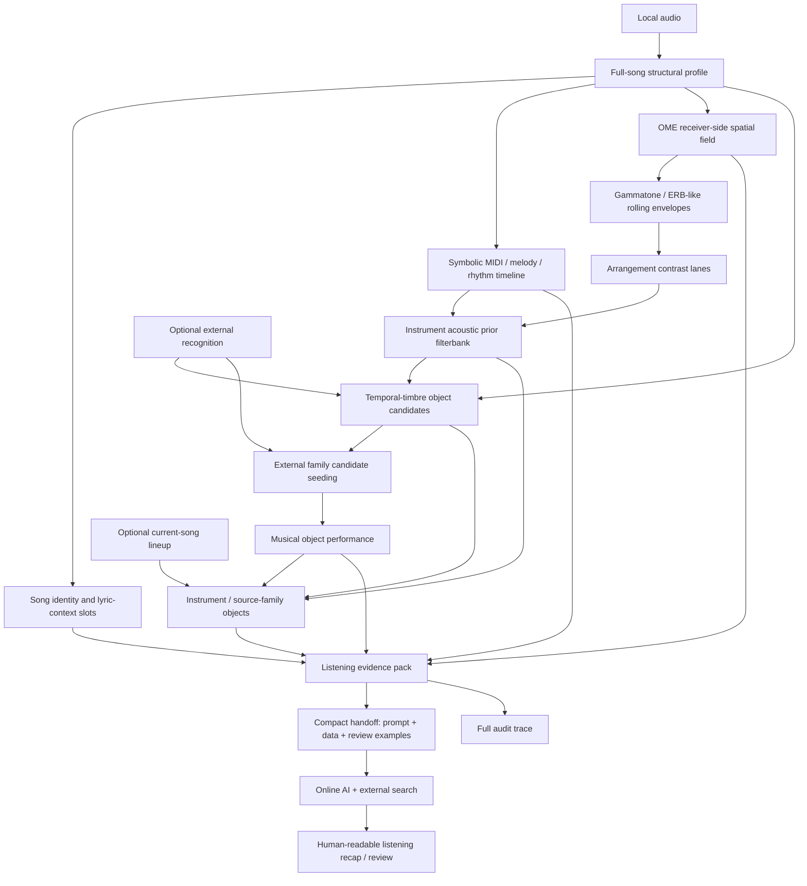

# Minimal Space for Simulated Listening

**Minimal Space for Simulated Listening (MSSL)** builds a minimal simulation space between audio evidence and human-readable listening experience.

> We do not train taste. We build a minimal spatiotemporal domain for simulated listening.  
> 我们不训练品味；我们构造模拟听觉所需的最小时空与语言承接结构。

## Current framework


```mermaid
flowchart TD
    A[Local audio] --> B[Full-song structural profile]
    B --> C[Song identity and lyric-context slots]
    B --> D[Symbolic MIDI / melody / rhythm timeline]
    B --> E[OME receiver-side spatial field]
    E --> F[Gammatone / ERB-like rolling envelopes]
    F --> G[Arrangement contrast lanes]
    G --> H[Instrument acoustic prior filterbank]
    D --> H
    B --> I[Temporal-timbre object candidates]
    H --> I
    J[Optional external recognition] --> I
    J --> K[External family candidate seeding]
    I --> K
    K --> L[Musical object performance]
    I --> M[Instrument / source-family objects]
    H --> M
    L --> M
    N[Optional current-song lineup] --> M
    C --> O[Listening evidence pack]
    D --> O
    E --> O
    L --> O
    M --> O
    O --> P[Compact handoff: prompt + data + review examples]
    O --> Q[Full audit trace]
    P --> R[Online AI + external search]
    R --> S[Human-readable listening recap / review]
```

The two existing root PNGs are earlier conceptual sketches. The Mermaid graph above is the current runtime authority.

## Project goal

Target report role:

```text
help an online AI describe what kind of song it is;
help it describe vocal, instrument, and effect-family performance;
help it connect verified lyric context to vocal timing / delivery;
help it combine general audio evidence, MIDI / melody evidence, and OME spatial state;
keep every source-family and lyric claim evidence-bounded.
```

Current target path:

```text
local audio
-> structural audio evidence
-> song identity layer
-> reconstructed stream / score layer
-> symbolic timeline MIDI layer
-> optional MIDI adapter command / adapter evidence
-> optional external recognition command / adapter evidence
-> external strong recognition layer
-> OME Spatial Filter Bank runtime layer
-> gammatone / ERB-like rolling envelope layer
-> OME arrangement contrast layer
-> instrument prior filterbank layer
-> temporal-timbre object candidate layer
-> component competition: positive evidence / counterevidence / candidate gap
-> musical object performance layer
-> instrument / source-family object layer
-> optional vocal transcription command / heard-lyric fragments
-> lyric context layer
-> listening-experience evidence pack
-> compact online AI handoff (listening recap composer) + full audit trace
-> bounded listening recap / close-listening criticism by an online AI account
```

The compact handoff is source material for an online AI. Its visible shape is deliberately simple: a light generation prompt that asks for external search, local data tables/timelines, and a few review examples. Detailed audit boundaries stay in JSON layers and the full-trace handoff instead of turning the final writing prompt into a checklist.

Object-family candidates should be formed from time-frequency-timbre continuity and optional external timbre / stem / transcription evidence, then mapped into receiver-side O/M/E space. OME field packets are spatial mapping support, not object identity by themselves.

Current MVP priority:

```text
make rough but explicit instrument / source-family object candidates visible.
```

MSSL should expose bounded candidates such as voice / vocal-like foreground, bass / low-register, drum / percussion, guitar / plucked, keyboard / piano, synth / pad / harmonic, and FX / texture / tail objects when supported by local acoustic evidence. These are not confirmed stems or source truth; they should carry status, confidence, missing evidence, and confusion groups instead of being hidden inside only functional labels.

MIDI in MSSL is a runtime music-time skeleton: beat/bar context, section timeline, symbolic stream events, and optional adapter-backed transcription evidence. Default MIDI output is not original MIDI truth.

The musical object performance layer is not a machine behavior layer. It describes vocal, instrument, and effect-family performance while preserving the family gate for verified source-family claims. The family gate should not be read as a ban on local source-family object candidates; without external evidence, those names remain candidate / possible / likely-local / weak-local language.

Song identity and lyric context are bounded layers. MSSL audio features alone do not prove title, artist, lyrics, lyric meaning, or singer identity. Those claims require supplied metadata, external identity evidence, lyric/alignment files, fingerprint/search context, or online AI verification.

MSSL does not need to rebuild every music-recognition capability itself, but the main run can call local adapter commands and fold their JSON output back into the report chain. External model outputs, optional adapters, reviews, MIR notes, and user aesthetic material may be introduced as bounded context. MSSL organizes claim boundaries, evidence traceability, and handoff structure.

The default project does **not** run a local LLM. The local pipeline prepares an uploadable compact handoff file for an online AI account.

## O/M/E frame

```text
O = source-centered wave-expansion space
M = source-to-receiver spatiotemporal mapping domain
E = receiver-centered auditory modeling space
```

MSSL treats sound as a bounded propagation relation from **O** through **M** into **E**, not as a single-point waveform-to-label conversion.

The O/M/E layer is not spatial-audio rendering and not a generic audio-feature table. It builds a receiver-side perceptual representation layer for AI listening handoff.

## One-command entry point

Use this first:

```powershell
.\.venv\Scripts\python.exe .\scripts\run_mssl.py `
  --input "path\to\local_audio.wav" `
  --output-dir outputs
```

With supplied song identity:

```powershell
.\.venv\Scripts\python.exe .\scripts\run_mssl.py `
  --input "path\to\local_audio.wav" `
  --output-dir outputs `
  --song-title "Song title" `
  --song-artist "Artist name"
```

With metadata / fingerprint identity command:

```powershell
.\.venv\Scripts\python.exe .\scripts\run_mssl.py `
  --input "path\to\local_audio.wav" `
  --output-dir outputs `
  --song-identity-command "python .\scripts\adapters\run_song_identity_adapter.py --input {input} --output-json {output_json} --metadata-command 'ffprobe -v quiet -print_format json -show_format -show_streams {input} > {metadata_json}'"
```

With lyric context, without exporting full lyrics into the handoff:

```powershell
.\.venv\Scripts\python.exe .\scripts\run_mssl.py `
  --input "path\to\local_audio.wav" `
  --output-dir outputs `
  --song-title "Song title" `
  --song-artist "Artist name" `
  --lyrics-file "path\to\lyrics.txt" `
  --lyric-alignment "path\to\lyric_alignment.json"
```

With bounded heard-lyric fragments from a Whisper-style ASR transcript:

```powershell
.\.venv\Scripts\python.exe .\scripts\run_mssl.py `
  --input "path\to\local_audio.wav" `
  --output-dir outputs `
  --vocal-transcription-command "python .\scripts\adapters\run_vocal_transcription_adapter.py --input {input} --output-json {output_json} --transcript-json path\to\whisper_output.json"
```

With a song-specific source lineup correction for the current run only:

```powershell
.\.venv\Scripts\python.exe .\scripts\run_mssl.py `
  --input "path\to\local_audio.wav" `
  --output-dir outputs `
  --source-lineup "path\to\user_source_lineup.json"
```

Optional real MIDI / transcription evidence can be attached as a bounded adapter packet:

```powershell
.\.venv\Scripts\python.exe .\scripts\run_mssl.py `
  --input "path\to\local_audio.wav" `
  --output-dir outputs `
  --midi-adapter "path\to\midi_adapter_packet.json"
```

Basic Pitch / MT3 style transcription can be normalized inside the main flow when a command writes notes JSON or CSV:

```powershell
.\.venv\Scripts\python.exe .\scripts\run_mssl.py `
  --input "path\to\local_audio.wav" `
  --output-dir outputs `
  --midi-adapter-command "python .\scripts\adapters\run_basic_pitch_adapter.py --input {input} --output-json {output_json} --notes-csv path\to\notes.csv"
```

Optional external recognition can run inside the main flow. The command must write one adapter JSON to `{output_json}`:

```powershell
.\.venv\Scripts\python.exe .\scripts\run_mssl.py `
  --input "path\to\local_audio.wav" `
  --output-dir outputs `
  --external-recognition-command "python path\to\recognizer.py --input {input} --output-json {output_json}"
```

Demucs / UVR stem output can be normalized inside the same external-recognition command slot:

```powershell
.\.venv\Scripts\python.exe .\scripts\run_mssl.py `
  --input "path\to\local_audio.wav" `
  --output-dir outputs `
  --external-recognition-command "python .\scripts\adapters\run_demucs_adapter.py --input {input} --output-json {output_json} --stems-dir path\to\stems"
```

Already generated recognition packets can still be attached directly:

```powershell
.\.venv\Scripts\python.exe .\scripts\run_mssl.py `
  --input "path\to\local_audio.wav" `
  --output-dir outputs `
  --external-recognition "path\to\recognition_packet.json"
```

Generic external JSON can be normalized first:

```powershell
python .\scripts\adapters\normalize_external_recognition_packet.py `
  --input-json "path\to\raw_tool_output.json" `
  --output-json "path\to\recognition_packet.json"
```

By default this runs `experience` mode and writes:

```text
online_ai_listening_handoff.md
online_ai_listening_handoff_full_trace.md
song_identity_layer.json / .md
reconstructed_stream_score_layer.md
symbolic_timeline_midi_layer.json / .md
external_strong_recognition_layer.json / .md
ome_spatial_filter_bank_layer.json / .md
ome_gammatone_envelope_layer.json / .md
ome_gammatonegram_mid.png / ome_gammatonegram_side.png
ome_arrangement_contrast_layer.json / .md
ome_arrangement_timeline.png / ome_arrangement_readable_summary.md
instrument_prior_filterbank_layer.json / .md
temporal_timbre_object_candidate_layer.json / .md
musical_object_performance_layer.json / .md
instrument_source_object_layer.json / .md
lyric_context_layer.json / .md
subjective_descriptor_proxy_layer.json / .md
ome_stream_descriptor_packets.json / .md
```

`online_ai_listening_handoff.md` is the compact online-AI input. Object identity support comes from time-frequency-timbre continuity, bounded prior-family competition, optional MIDI/pitch, and optional external evidence; OME supplies receiver-side mapping. The compact file presents prompt + data + review examples, while detailed audit material remains in the full trace and JSON layers.

## Documentation map

```text
docs/a_professional_term_index.md
docs/b_mssl_scope_boundary.md
docs/c_online_handoff_translation.md
docs/d_adapter_gate.md
docs/e_runtime_entrypoints.md
docs/f_validation_samples.md
docs/g_project_log.md
```

Do not add standalone docs unless the topic cannot be folded into A/B/C/D/E/F/G.

## Outputs policy

Do not commit generated outputs or local media:

```text
outputs/
*.wav
*.mp3
*.m4a
*.flac
.venv/
__pycache__/
```
