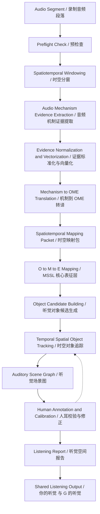

# MSSL Runtime Pipeline

Project: **Minimal Space for Simulated Listening**  
Codename: **Groove Ear / 给 AI 耳朵**  
Status: current runtime framing

---

## 1. Core runtime sentence

```text
MSSL converts recorded audio evidence into a receiver-side auditory object report.
```

中文：

```text
MSSL 将录制音频证据转译为接收端听觉对象报告。
```

The runtime must not be read as:

```text
audio -> features -> normal review
```

It must be read as:

```text
recorded signal evidence
-> spatiotemporal windows
-> audio mechanism evidence
-> O/M/E translation
-> auditory object tracking
-> listening report
```

---

## 2. Stable execution framework

This is the current high-level execution framework. It intentionally does not expand every sub-rule as an execution branch.



The dashed feedback line means human listening annotation can correct object tracking. It is not a normal forward-only audio feature pipeline.

---

## 3. Double-window rule

MSSL should not treat windowing as only a time split.

Every analysis unit should bind:

```text
time window + spatial window = spatiotemporal cell
```

For full-song analysis this becomes:

```text
whole WAV
-> audio-derived structural segments
-> segment-level spatiotemporal cells
-> frame evidence under each segment
-> O/M/E mapping for each segment
-> segment-to-segment object continuity
```

This replaces the old one-second validation habit. One-second and sub-second frames can still exist, but they are machine inspection scale, not the main report scale.

---

## 4. What belongs in sub-rules, not main arrows

These must not be drawn as main execution branches:

```text
FFT / STFT / CWT / Morlet details
source separation details
vocal locking details
identity firewall details
style-profile heuristics
human annotation templates
```

They belong in documents or adapters:

```text
docs/audio_processing_mechanism_index.md
docs/mechanism_to_ome_translation.md
docs/source_separation_as_object_evidence.md
docs/vocal_locking_as_object_evidence.md
docs/full_song_analysis_pipeline.md
```

The main runtime should stay clean.

---

## 5. Boundary

MSSL does not claim:

```text
real physical 3D source reconstruction
true instrument recognition
true singer identity
voiceprint recognition
ASR / lyric transcription
objective music taste
```

Safe claim:

```text
MSSL derives evidence from a recorded stereo trace and translates it into receiver-side perceived-space object candidates.
```
